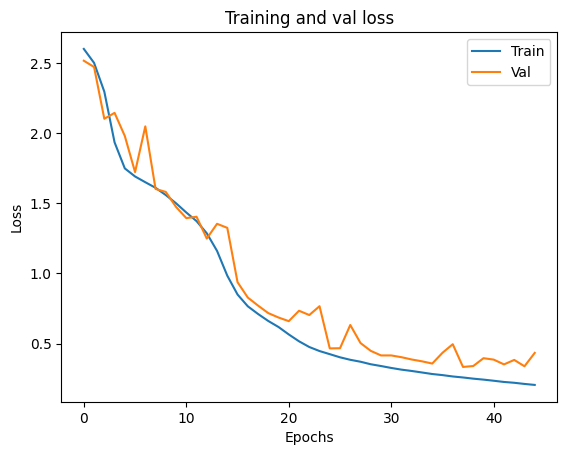
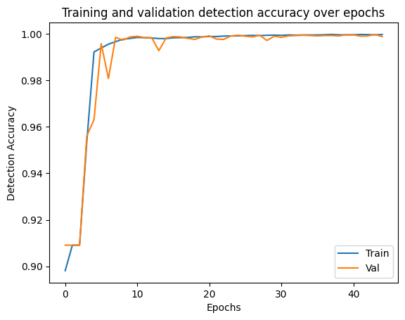
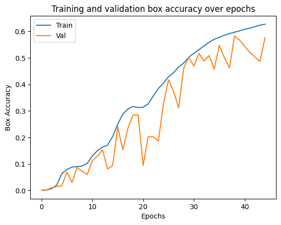
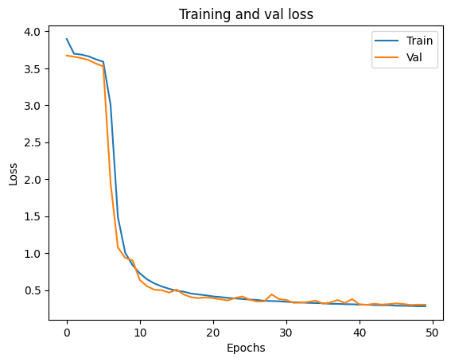
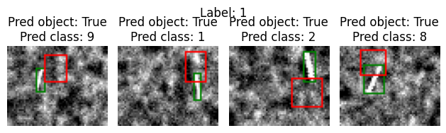
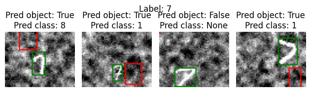
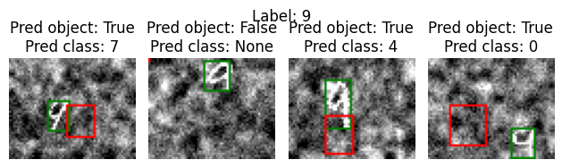
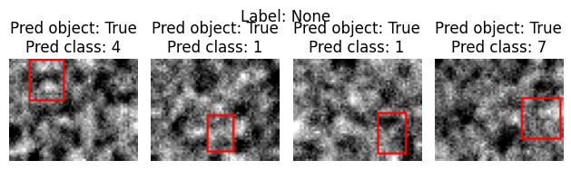

# Introduction
This report aims to explain our approach and design choices for defining, training and evaluating CNNs for the tasks of object localization and object detection. Additionally, we will discuss the performance of our models and evaluate our implementations.

For general information and setup guidance, please refer to the [README](README.md).

### Contributions
There is some overlap, but here is a general overview of what each project member contributed with: 

- **Simon Vedaa**: Model architecture, loss functions, preprocessing, model training and selection, plotting, documentation and project report
- **Sebastion Røkholt**: Performance metrics, training loop, documentation and project report

\newpage

# Data Exploration, Analysis and Preprocessing

For both tasks the input consists of images of digits, with 
values lying between 0 and 1. In localization, there is only one or 
no digit per image. In detection, there are one or two digits per image.
Images in both datasets are of size 48x60, with only a single channel.

## Labels 

The labels in localization includes the following:

- Proababilty of object: Whether there is a digit present or not.
- Center x: The x coordinate of the bounding box.
- Center y: The y coordinate of the bounding box.
- Height: The height of the bounding box.
- Width: The width of the bounding box.
- Class: Which digit the image contains.


The labels in detection uses the same values as in localization,
but instead of having one label for the whole image, the images and labels 
are divided into a grid. The label then becomes a collection of the labels 
of each grid cell.
This requires a preprocessing step, which includes translating the global 
bounding box coordinates, into local coordinates relative to the grid cell.
The processed labels then becomes a $n * m * 6$ tensor.
In our project, we chose to use a grid of 2 rows and 3 columns, 2x3.


## Class distribution

The classes are equally distributed, and no significant imbalance is found.


## Normalization

The only preprocessing step besides processing the labels, is normalization.
For each task, the input data is normalized based on values from training data.

\newpage

## Ground Truth Examples

{width=60%}
{width=60%}

{width=60%}
{width=60%}

{width=60%}
{width=60%}

{width=60%}
{width=60%}

{width=60%}
{width=60%}

{width=70%}
\begin{figure}[!h]
\caption{Ground truth labels and bounding boxes for localization dataset}
\end{figure}


{width=70%}

\newpage

# Approach and Design choices

## Task 1: Object localization
**Goal**: Train a CNN that can predict

 - Whether there is a single handwritten digit in a black and white image (0 = no, 1 = yes)
 - The bounding box of this digit (x-coordinate, y-coordinate, height and width)
 - Which digit it is (out of two possibilities: 0 or 1)

### Loss function

To calculate the total cost of a localization prediction, we use an ensemble of three different loss metrics:

- **Detection loss**: Binary cross entropy on whether there is a class or not in the image.
- **Bounding box loss**: Mean square error on bounding box coordinates and size.
- **Classification loss**: Cross entropy loss on the class predictions.

Details:

 - We use cross entropy with logits, as the model's output isn't run through a sigmoid activation.
 - If there is no object in the image, only the detection loss is used. Otherwise the total loss is the sum of the three losses. 
 - Weights are updated after each batch, so the loss used for backpropagation is the mean loss for the current batch.


### Performance function
TODO


### Model architectures

Two model architectures have been created for this task. Both are relatively simple
architectures, one being deeper than the other. Stride is 1 in all convolutional
layers in both architectures.

#### LocalNet1

- Conv 1: in_channels=1, out_channels=3, padding=0
- MaxPool 2x2 with stride=2
- Conv 2: in_channels=3, out_channels=8, padding=0
- MaxPool 2x2 with stride=2
- fc1: input=1040, output=120
- fc2: input=120, output=60
- fc3: input=60, output=15

Both convolutional layers and the first the fully connected layers are 
passed through a relu activation function. The output of the last fully
connected layer is the output of the model.


#### LocalNet2

- Conv 1: in_channels=1, out_channels=6, padding=1
- MaxPool 2x2 with stride=2
- Conv 2: in_channels=6, out_channels=12, padding=1
- MaxPool 2x2 with stride=2
- Conv 3: in_channels=12, out_channels=24, padding=1
- MaxPool 3x3 with stride=3
- Conv 4: in_channels=24, out_channels=48, padding=1
- fc1: input=960, output=960
- fc2: input=960, output=320
- fc3: input=320, output=80
- fc4: input=80, output=15

All convolutional layers and the three first fully connected layers
are passed through a relu activation function.
The last layer is the output of the model.


## Task 2: Object detection

**Goal**: Train a CNN that can predict

 - Whether there are any handwritten digits in a black and white image (0 = no, 1 = yes)
 - The bounding box of each digit (x-coordinate, y-coordinate, height and width)
 - Which digits have been detected (out of two possibilities: 0 or 1)

### Detection grid
TODO

### Loss function

The loss function for object detection is similar to localization.
The loss becomes the sum of localization loss for each grid cell.
We vectorized the localization on grid cells to speed up loss calculation.
The final loss is the the batch mean of the summed losses.


### Performance function
TODO

### Model architectures

Both models consist only of convolutional layers, and both outputs
a 2x3 grid with 6 channels. Stride is 1 for all convolutional layers in 
both architectures.


#### DetectNet1_2x3

- Conv 1: in_channels=1, out_channels=2, padding=1, kernel=3x3
- MaxPool 2x2 with stride=2
- Conv 2: in_channels=2, out_channels=4, padding=1, kernel=3x3
- MaxPool 2x2 with stride=2
- Conv 3: in_channels=4, out_channels=6, padding=1, kernel=3x3
- MaxPool 3x3 with stride=3
- Conv 4: in_channels=6, out_channels=6, padding=0, kernel=3x3

All convolutional layers except the last,
are passed through a relu activation function.


#### DetectNet2_2x3

- Conv 1: in_channels=1, out_channels=2, padding=1, kernel=3x3
- Conv 2: in_channels=2, out_channels=4, padding=1, kernel=3x3
- MaxPool 2x2 with stride=2
- Conv 3: in_channels=4, out_channels=8, padding=1, kernel=3x3
- Conv 4: in_channels=8, out_channels=16, padding=1, kernel=3x3
- MaxPool 2x2 with stride=2
- Conv 5: in_channels=16, out_channels=32, padding=1, kernel=3x3
- Conv 6: in_channels=32, out_channels=32, padding=1, kernel=3x3
- MaxPool 3x3 with stride=3
- Conv 7: in_channels=32, out_channels=16, padding=1, kernel=3x3
- Conv 8: in_channels=16, out_channels=8, padding=1, kernel=3x3
- Conv 9: in_channels=8, out_channels=6, padding=0, kernel=3x3

All convolutional layers except the last,
are passed through a relu activation function.


\newpage

# Model training, selection and evaluation

## Training function

The same training function is used for both object localization and 
object detection. The parameter ```task```, specifies the task, and affects
the performance calculation while training.
Training performance is returned in a dictionary.

We are using SGD(Stochastic Gradient Descent) as optimizer when training.

The training function includes an early stopping criteria to prevent overfitting,
and uneccesary training. It uses a patience counter and a minimum change value.
When validation loss + minimum change is equal or higher to validation loss 
in the previous epoch, the patience counter counts down. When it reaches zero,
training stops.

The function ```train_models``` is used for training with different model 
architectures and hyperparameters.

In both tasks, we've used a batch size of 64, patience counter of 7, minimum change value 0,
and trained for maximum 50 epochs.


\newpage

## Model selection

In both tasks, the model with the highest strict accuracy is chosen for testing.
As it takes a while to train, we have only chosen to grid search over the 
parameters of the optimizer. The parameters were chosen somewhat arbitrarely,
as we did not have enough time for a more thorough selection.


### Localization

These are the parameters we tested for localization:

| Learning rate    | Weight Decay    | Momentum    |
|---------------- | --------------- | --------------- |
| 0.001    | 0.0    | 0.3    |
| 0.001    | 0.0005    | 0.1    |
| 0.01   | 0.0   | 0.4   |
| 0.01   | 0.0001   | 0.1   |
| 0.005   | 0.0001   | 0.6   |

**Selected Architecture**: LocalNet2

**Selected parameters**:

| Learning rate    | Weight Decay    | Momentum    |
|---------------- | --------------- | --------------- |
| 0.005    | 0.0001    | 0.6    |

\newpage

{width=50%}

{width=50%}
{width=50%}
\begin{figure}[!h]
\caption{Detection and mean accuracy}
\end{figure}

{width=50%}
{width=50%}
\begin{figure}[!h]
\caption{Box and strict accuracy}
\end{figure}


### Detection

These are the parameters we tested for detection:

| Learning rate    | Weight Decay    | Momentum    |
|---------------- | --------------- | --------------- |
| 0.001    | 0.0001    | 0.2    |
| 0.001    | 0.0005    | 0.1    |
| 0.005   | 0.0   | 0.3   |
| 0.005   | 0.0001   | 0.1   |


**Selected Architecture**: DetectNet2_2x3

**Selected Parameters**:

| Learning rate    | Weight Decay    | Momentum    |
|---------------- | --------------- | --------------- |
| 0.005   | 0.0001   | 0.1   |

Performance graphs of selected model:

{width=70%}

{width=70%}

\newpage

## Evaluation
- Evaluation of the best model
- What worked well, what didn't. Challenges. Overall process
- Further improvements that could be made


### Localization

The chosen architecture for localization was LocalNet2. That is not too suprising
as it is the most complex model out the localization architectures. Looking at 
the loss (Figure 3), it seems that the model could be improved further. Both validation 
loss and performance oscillates, while training has a smooth curve. Given more training 
time, the model could improve, or possibly start to overfit. It is possible that the criteria 
for early stopping was too strict.

I think the model might be too shallow, and therfore struggles to increase the performance. 
For example, using a residual convolutional network would allow us to create a much deeper network.

#### Test performance

| Performance measure   |     |
|--------------- | --------------- |
| Strict accuracy  | 62.15%   |
| Box accuracy   | 58.54%   |
| Detection accuracy   | 99.81%   |
| Mean accuracy   | 79.17%   |


\newpage

#### Predictions

$$ $$ <!-- This is neccesary for spacing reasons XD -->

{width=60%}
{width=60%}

{width=60%}
{width=60%}

{width=60%}
{width=60%}

{width=60%}
{width=60%}

{width=60%}
{width=60%}

{width=60%}
\begin{figure}[!h]
\caption{Class and bounding box predictions for localization dataset}
\end{figure}


\newpage
### Detection

The selected model architecture for detection was DetectNet2_2x3. This is also not 
suprising, as it is almost double the depth as DetectNet1_2x3. It's performance 
however is rather poor, only achieving 6.19% in strict accuracy. Looking at its loss 
curve (Figure 6), it seems to have converged to a minimum, and probably would not benefit 
from training longer. To improve performance on this task, it is probably neccesary to 
use a much deeper network and let it train longer than 50 epochs.

| Performance measure   |     |
|--------------- | --------------- |
| Strict accuracy  | 6.19%   |


#### Predictions

$$ $$ <!-- This is neccesary for spacing reasons XD -->


