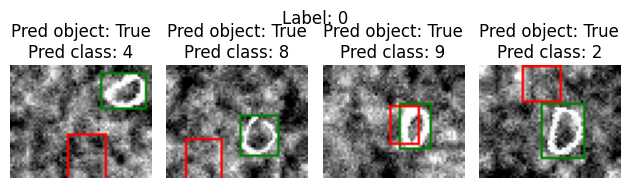
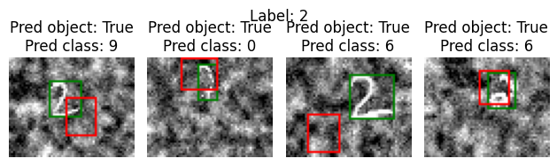
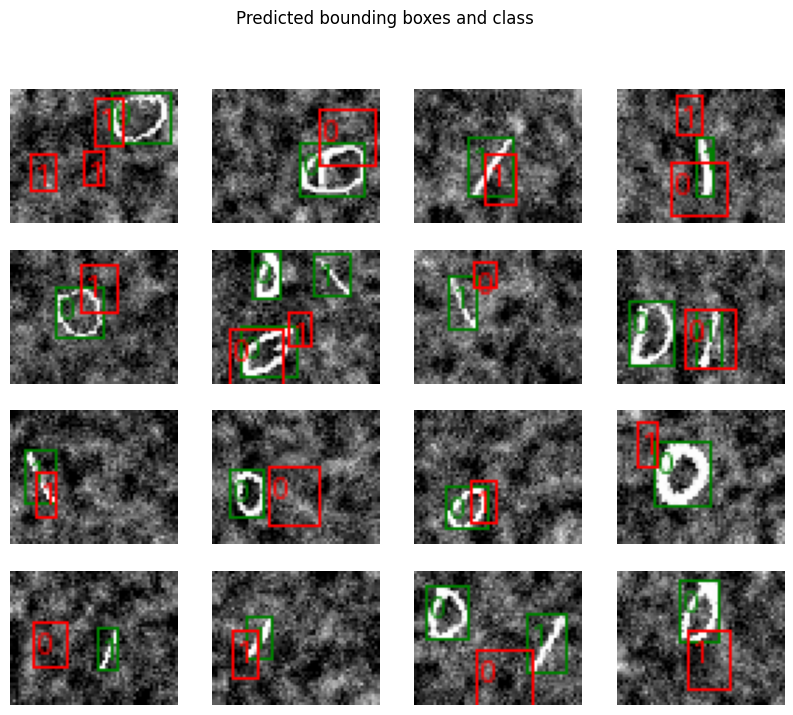

# Introduction
This report aims to explain our approach and design choices for defining, training and evaluating CNNs for the tasks of object localization and object detection. Additionally, we will discuss the performance of our models and evaluate our implementations.

For general information and setup guidance, please refer to the [README](README.md).

### Contributions
There is some overlap, but here is a general overview of what each project member contributed with: 

- **Simon Vedaa**: Model architecture, loss functions, preprocessing, model training and selection, plotting, documentation and project report
- **Sebastion Røkholt**: Performance metrics, training loop, documentation and project report

\newpage

# Data Exploration, Analysis and Preprocessing

For both tasks, the inputs are 48x60 black and white (single channel) images containing digits that have been randomly shifted, rotated and resized. For object localization, the images either contain no objects or a single integer digit in the range 0 - 9. For object detection, the images contain none, one or multiple digits that are either 1's or 0's.

## Labels 

Each image in the dataset has a corresponding (ground truth) label. The label is a 6-dimensional vector that includes

1. **P_c**: The probabilty of there being an object in the image, i.e. whether there is a digit present or not.
2. **x**: The x coordinate of the bounding box centre.
3. **y**: The y coordinate of the bounding box centre.
4. **h**: The pixel height of the bounding box.
5. **w**: The pixel width of the bounding box.
6. **C**: The object class, i.e. which digit the image contains. 


For detection, we use the same label vector values as in localization, but instead of having one label for the whole image, the images and labels are sub-divided into a grid. The ground truth label then becomes a collection of the labels for each grid cell. This necessitates a preprocessing step where the global bounding box coordinates are translated into local coordinates that are relative to the object's grid cell. For an $n * m$ grid, the new label becomes a tensor of shape (n, m, 6). For this project, we decided to use a grid size of 2 x 3, creating a total of 6 grid cell labels for each image.


## Datset size and distribution
The localization datasets for training, validation and testing contain 77,000 images in total with a split of 77%, 9% and 14% of the data, respectively. In each dataset, the classes are equally distributed. See the [object localization notebook](https://github.com/simsam8/inf265_project2/blob/main/notebooks/object_localization.ipynb) for more details. 


## Normalization

Normalization was the only preprocessing step we performed besides processing the labels. For both tasks, all three data sets were normalized with a mean and standard deviation calculated from the training data. 

\newpage

## Ground Truth Examples

{width=60%}
{width=60%}

{width=60%}
{width=60%}

{width=60%}
{width=60%}

{width=60%}
{width=60%}

{width=60%}
{width=60%}

{width=70%}
\begin{figure}[!h]
\caption{Ground truth labels and bounding boxes for localization dataset}
\end{figure}


{width=70%}

\newpage

# Approach and Design choices

## Task 1: Object localization
**Goal**: Train a CNN that can predict

 - Whether there is a single handwritten digit in a black and white image (0 = no, 1 = yes)
 - The bounding box of this digit (x-coordinate, y-coordinate, height and width)
 - Which digit it is (out of two possibilities: 0 or 1)

### Loss function

To calculate the total cost of a localization prediction, we use an ensemble of three different loss metrics:

- **Detection loss**: Binary cross entropy on whether there is a class or not in the image.
- **Bounding box loss**: Mean square error on bounding box coordinates and size.
- **Classification loss**: Cross entropy loss on the class predictions.

We use cross entropy with logits, as the model's output isn't run through a sigmoid activation. If there is no object in the image, only the detection loss is used. Otherwise the total loss is the sum of the three losses. Weights are updated after each batch, so the loss used for backpropagation is the mean loss for the current batch.


#### Performance function
We decided to compute four different performance metrics to aid us in evaluating the localization model: 
1. **Detection accuracy**: The prediction accuracy for P_c, i.e. whether the image contains an image or not. 
2. **Box accuracy**: The accuracy for the correct placement of the predicted bounding box. For each image, the prediction was deemed "correct" if the Intersection Over Union (IOU) value was greater than the threshold, which we set to 0.5. We chose this value because it is the conventional default for IOU, and it seemed to be an appropriate compromise between leniency and strictness when we experimented with different values. 
3. **Mean accuracy**: The per-image mean of detection and box accuracy. 
4. **Strict accuracy**: We couldn't find an existing metric that fit this value, so we named this metric "strict" accuracy as it is a challenging metric than a simple mean of the bounding box and detection accuracies. Strict accuracy only counts a prediction as "correct" if:
 - The model correctly predicts that there is no object in the image, or:
 - The model correctly predicts that there is an object in the image, correctly locates all objects with an IOU greater than 0.5, and assigns each object the correct class. 

The detection accuracy metric counts a prediction as "correct" if it is able to state whether there is an object present or not. In other words, it answers the question: "How often is the model correct in detecting that there is an object present in the image?" On the other hand, the bounding box accuracy is only computed whenever the image actually contains an object, which provides an answer to the question: "When the model attempts to locate an object, how often does it correctly place the bounding box and assign the correct class?" Combining these two metrics with a simple mean does *not* answer the question of how often a model's predictions for an image were *completely* correct (detection, localization(s) and classification(s) were all correct). This question is answered by the "strict" accuracy metric. 

### Model architectures

Two model architectures have been created for this task. Both are relatively simple
architectures, one being deeper than the other. Stride is 1 in all convolutional
layers in both architectures.

#### LocalNet1

- Conv 1: in_channels=1, out_channels=3, padding=0
- MaxPool 2x2 with stride=2
- Conv 2: in_channels=3, out_channels=8, padding=0
- MaxPool 2x2 with stride=2
- fc1: input=1040, output=120
- fc2: input=120, output=60
- fc3: input=60, output=15

Both convolutional layers and the first the fully connected layers are 
passed through a relu activation function. The output of the last fully
connected layer is the output of the model.


#### LocalNet2

- Conv 1: in_channels=1, out_channels=6, padding=1
- MaxPool 2x2 with stride=2
- Conv 2: in_channels=6, out_channels=12, padding=1
- MaxPool 2x2 with stride=2
- Conv 3: in_channels=12, out_channels=24, padding=1
- MaxPool 3x3 with stride=3
- Conv 4: in_channels=24, out_channels=48, padding=1
- fc1: input=960, output=960
- fc2: input=960, output=320
- fc3: input=320, output=80
- fc4: input=80, output=15

All convolutional layers and the three first fully connected layers
are passed through a relu activation function.
The last layer is the output of the model.


## Task 2: Object detection

**Goal**: Train a CNN that can predict

 - Whether there are any handwritten digits in a black and white image (0 = no, 1 = yes)
 - The bounding box of each digit (x-coordinate, y-coordinate, height and width)
 - Which digits have been detected (out of two possibilities: 0 or 1)

### Detection grid
The input images were small and wide, and when we looked a selection of images from the training dataset, we couldn't see many objects that covered an area less than 1/10th or more than 1/6th of the total image. The images with multiple digits also didn't seem to have them very close together. Therefore, we decided to use  relatively large grid size of 2x3. In the future, we would like to experiment more thoroughly with a variation of different grid shapes. 

Since we needed to use local (cell) coordinates for the loss function, we wrote a function ```_global_to_local``` that converted the image object coordinates from the global location to the coordinates corresponding to the local cell location. However, when we calculated the IOU for the box accuracy performance metric, we needed to convert local prediction coordinates back to global coordinates, so we also had to write the function ```_local_to_global```.

### Loss function

The loss function for object detection is similar to localization.
The loss becomes the sum of localization loss for each grid cell.
We vectorized the localization on grid cells to speed up the loss calculation.
As in localization, the final loss is the the batch mean of the summed losses.


### Performance function
For object detection, we decided to only use the Mean Average Precision (MAP) metric, which we calculated by converting the label and prediction tensors to a format we could then input to the ```MeanAveragePrecision``` metric class in the ```torchmetrics``` package. 

For each object class, ```MeanAveragePrecision``` first calculates the Average Precision (AP) by computing the precision and recall at different threshold levels. The AP is then the area under the precision-recall curve. Then, it calculates the mean of the AP's for all classes. For our evaluation, we use the default range of thresholds from 0.5 to 0.95 with a step size of 0.05. 

### Model architectures

Both models consist only of convolutional layers, and both outputs
a 2x3 grid with 6 channels. Stride is 1 for all convolutional layers in 
both architectures.


#### DetectNet1_2x3

- Conv 1: in_channels=1, out_channels=2, padding=1, kernel=3x3
- MaxPool 2x2 with stride=2
- Conv 2: in_channels=2, out_channels=4, padding=1, kernel=3x3
- MaxPool 2x2 with stride=2
- Conv 3: in_channels=4, out_channels=6, padding=1, kernel=3x3
- MaxPool 3x3 with stride=3
- Conv 4: in_channels=6, out_channels=6, padding=0, kernel=3x3

All convolutional layers except the last,
are passed through a relu activation function.


#### DetectNet2_2x3

- Conv 1: in_channels=1, out_channels=2, padding=1, kernel=3x3
- Conv 2: in_channels=2, out_channels=4, padding=1, kernel=3x3
- MaxPool 2x2 with stride=2
- Conv 3: in_channels=4, out_channels=8, padding=1, kernel=3x3
- Conv 4: in_channels=8, out_channels=16, padding=1, kernel=3x3
- MaxPool 2x2 with stride=2
- Conv 5: in_channels=16, out_channels=32, padding=1, kernel=3x3
- Conv 6: in_channels=32, out_channels=32, padding=1, kernel=3x3
- MaxPool 3x3 with stride=3
- Conv 7: in_channels=32, out_channels=16, padding=1, kernel=3x3
- Conv 8: in_channels=16, out_channels=8, padding=1, kernel=3x3
- Conv 9: in_channels=8, out_channels=6, padding=0, kernel=3x3

All convolutional layers except the last,
are passed through a relu activation function.


\newpage

# Model training, selection and evaluation

## Training function

The same training function is used for both object localization and 
object detection. The parameter ```task```, specifies the task, and affects
the performance calculation while training.
Training performance is returned in a dictionary.

We are using SGD(Stochastic Gradient Descent) as optimizer when training.

The training function includes an early stopping criteria to prevent overfitting,
and uneccesary training. It uses a patience counter and a minimum change value.
When validation loss + minimum change is equal or higher to validation loss 
in the previous epoch, the patience counter counts down. When it reaches zero,
training stops.

The function ```train_models``` is used for training with different model 
architectures and hyperparameters.

In both tasks, we've used a batch size of 64, patience counter of 7, minimum change value 0,
and trained for maximum 50 epochs.


\newpage

## Model selection

For the localization task, we selected the model with the highest "strict" accuracy. For object detection, we chose the model with the highest MAP score. 
As it takes a while to train, we have only chosen to grid search over the 
parameters of the optimizer. The parameters were chosen somewhat arbitrarely,
as we did not have enough time for a more thorough selection.


### Localization

These are the parameters we tested for localization:

| Learning rate    | Weight Decay    | Momentum    |
|---------------- | --------------- | --------------- |
| 0.001    | 0.0    | 0.3    |
| 0.001    | 0.0005    | 0.1    |
| 0.01   | 0.0   | 0.4   |
| 0.01   | 0.0001   | 0.1   |
| 0.005   | 0.0001   | 0.6   |

**Selected Architecture**: LocalNet2

**Selected parameters**:

| Learning rate    | Weight Decay    | Momentum    |
|---------------- | --------------- | --------------- |
| 0.005    | 0.0001    | 0.6    |

\newpage

{width=50%}

{width=50%}
{width=50%}
\begin{figure}[!h]
\caption{Detection and mean accuracy}
\end{figure}

{width=50%}
{width=50%}
\begin{figure}[!h]
\caption{Box and strict accuracy}
\end{figure}


### Detection

These are the parameters we tested for detection:

| Learning rate    | Weight Decay    | Momentum    |
|---------------- | --------------- | --------------- |
| 0.001    | 0.0001    | 0.2    |
| 0.001    | 0.0005    | 0.1    |
| 0.005   | 0.0   | 0.3   |
| 0.005   | 0.0001   | 0.1   |


**Selected Architecture**: DetectNet2_2x3

**Selected Parameters**:

| Learning rate    | Weight Decay    | Momentum    |
|---------------- | --------------- | --------------- |
| 0.005   | 0.0001   | 0.1   |

Performance graphs of selected model:

{width=70%}

{width=70%}

\newpage

## Evaluation
- Evaluation of the best model
- What worked well, what didn't. Challenges. Overall process
- Further improvements that could be made


### Localization

The chosen architecture for localization was LocalNet2. That is not too suprising
as it is the most complex model out the localization architectures. Looking at 
the loss (Figure 3), it seems that the model could be improved further. Both validation 
loss and performance oscillates, while training has a smooth curve. Given more training 
time, the model will likely see an improvement before starting to overfit. The criteria 
for early stopping may have been too strict.

The model loss quickly converged during training and we weren't able to see any significant improvement to model performance by inceasing the training time. We therefore believe that the model isn't able to sufficiently capture the complexity of the training data. We find it likely that the model isn't able to compute useful high-level features, because it has a low capacity due to the shallowness of the network. The network architecture could therefore be significantly improved by greatly increasing the number of layers, which can be achieved by using a residual convolutional network. 

#### Test performance

| Performance measure   |     |
|--------------- | --------------- |
| Strict accuracy  | 62.15%   |
| Box accuracy   | 58.54%   |
| Detection accuracy   | 99.81%   |
| Mean accuracy   | 79.17%   |


\newpage

#### Predictions

$$ $$ <!-- This is neccesary for spacing reasons XD -->

{width=60%}
{width=60%}

{width=60%}
{width=60%}

{width=60%}
{width=60%}

{width=60%}
{width=60%}

{width=60%}
{width=60%}

{width=60%}
\begin{figure}[!h]
\caption{Class and bounding box predictions for localization dataset}
\end{figure}


\newpage
### Detection

The selected model architecture for detection was DetectNet2_2x3. This is also not 
suprising, as it is almost twice as deep as DetectNet1_2x3. However, its performance is poor, achieving a Mean Average Precision of 6.19%. This means that the model likely has both low precision (i.e. it has a high number of false positives) and low recall (i.e. it misses a significant number of actual objects). 

Looking at its loss 
curve (Figure 6), the model seems to have converged to a minimum, and probably would not benefit 
from increased training time. As this task is more challenging than localization, we believe that the model faces the same problems as the localization model and that similar improvements need to be made: Increase the number of layers and let it train longer than 50 epochs.

| Performance measure   |     |
|--------------- | --------------- |
| Mean Average Precision  | 6.19%   |


#### Predictions

$$ $$ <!-- This is neccesary for spacing reasons XD -->


